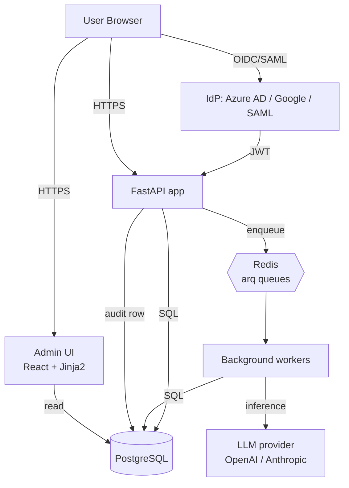

# Phase 3: Architecture

## Phase Goal
Design the system architecture — HTTP surface, internal data flow, integrations, and the layered separation between the application plane (FastAPI), the data plane (Postgres), the async plane (Redis + arq workers), and the identity plane (SSO via Authlib).

The platform has five subsystems that must compose:
1. **Data ingest** (raw → typed → cleaned)
2. **Templates** (stored in DB, versioned)
3. **Suggestion generation** (async workers)
4. **Review workflow** (human-in-the-loop)
5. **Audit log** (every action attributed)

Each is implemented as its own module that owns one Postgres table and exposes typed Pydantic schemas to the rest of the system.

## Files to Create

```file:app/orchestrator/__init__.py
"""Orchestrator package — wires data ingest → templates → suggestion → review → audit."""
```

```file:app/orchestrator/ingest.py
"""Data ingest pipeline — raw rows → validated → cleaned → versioned.

The pipeline is idempotent: re-running ingest on the same source produces the
same row hash, so duplicate ingest is a no-op. Each stage is retryable via
the durable Postgres-backed queue.

Stages:
1. ``extract(source)`` — pulls raw rows from the source adapter.
2. ``validate(raw)`` — Pydantic-validates against the source schema.
3. ``clean(validated)`` — applies the source's cleaning rules (trim,
   lowercase, dedup, normalize dates, etc.).
4. ``persist(cleaned)`` — inserts into ``ingested_rows`` with a row_hash.
5. ``enqueue_suggestion(row_id)`` — fires a suggestion-generation job.

If any stage fails, the row is recorded in ``ingest_failures`` with the
exception and stack trace. The next ingest run picks up where we left off.
"""
```

```file:app/orchestrator/templates.py
"""Template registry — templates are data, not code.

A :class:`Template` is a row in the ``templates`` table that defines how a
piece of data should be processed: which fields to extract, which
transformations to apply, which suggestion prompt to run. Templates are
versioned; a template version can be in ``draft``, ``active``, or
``archived`` state. Only one version per template ``key`` is ``active`` at
a time.

Templates are loaded by the suggestion worker at job start. A template
edit does NOT require a deploy — admins edit templates in the UI, click
``Activate``, and the next ingest run picks up the new version.
"""
```

```file:app/orchestrator/suggestions.py
"""Suggestion engine — async workers produce ``Suggestion`` rows for review.

The engine reads an ``ingested_row`` + an ``active_template``, runs the
template's prompt (rule-based + optional LLM fallback), and writes a
``Suggestion`` row with a confidence score. Suggestions land in the
``pending_review`` queue (see ``review.py``).

LLM calls go through the existing ``app.llm`` provider abstraction. If
the LLM is unavailable, the engine falls back to a deterministic
rule-based extraction using the template's ``rules`` field. The audit
log records which path was taken.
"""
```

```file:app/orchestrator/review.py
"""Review queue — humans approve/reject/edit Suggestions.

The review queue is a Postgres-backed table with three states:
``pending``, ``approved``, ``rejected``. Approving a suggestion applies
its output to the target resource (e.g., writes a row to the
``customer_records`` table). Rejecting discards. Every state transition
is recorded in the audit log with the reviewer user-id.

The API surface (``/api/review/pending``, ``/api/review/{id}/resolve``)
is thin — it just reads/writes the queue. The UI lives in ``app/ui/``.
"""
```

```file:app/orchestrator/audit.py
"""Audit log — every action attributed.

A single :class:`AuditLog` row is written for every state-changing
operation across the platform: SSO login, template edit, ingest run,
suggestion created/approved/rejected, RBAC role change. Each row carries:
- who (user_id from SSO claims, never trusted from the client)
- what (action verb + resource type + resource id)
- when (timestamp with timezone)
- before_state / after_state (JSONB diff)
- ip_address, user_agent (for forensics)
- request_id (for correlation with structured logs)

The audit log is append-only — no UPDATE, no DELETE. Database-level
revoke of those permissions is part of the migration.
"""
```

```file:app/orchestrator/identity.py
"""Identity plane — SSO via Authlib (OAuth2/OIDC + SAML).

The identity plane is the only thing that produces user identities.
``current_user()`` is a FastAPI dependency that:
1. Reads the session cookie.
2. Validates the JWT against the configured IdP's JWKS.
3. Resolves the IdP's group claim to our internal RBAC role.
4. Returns a typed :class:`Principal` with ``user_id``, ``email``,
   ``role``, ``scopes``.

Login flows:
- **OAuth2/OIDC (Azure AD, Google Workspace)** — Authlib's OAuth client
  + Starlette's session middleware. The /auth/login endpoint redirects
  to the IdP; /auth/callback exchanges the code for tokens.
- **SAML (Okta, OneLogin, ADFS)** — python-saml for SP-initiated SSO.
  We expose /auth/saml/login and /auth/saml/acs.
"""
```

```file:app/orchestrator/workers.py
"""Background workers — arq-based async task runner.

Workers consume jobs from Redis-backed arq queues:
- ``ingest_queue`` — runs the ingest pipeline on a schedule or webhook
- ``suggestion_queue`` — generates suggestions from pending rows
- ``audit_compaction_queue`` — daily rollup of audit rows older than 90
  days into monthly aggregates (keeps the live table queryable)

Each worker is a separate process started via ``arq app.orchestrator.workers.settings``.
Workers have read-only DB access plus a separate ``worker_role`` Postgres
user that cannot UPDATE the audit_log table.
"""
```

## Architecture diagram



## Component responsibilities

| Component | Owns | Reads | Writes |
|-----------|------|-------|--------|
| **FastAPI app** | HTTP surface, request validation, RBAC | DB (read-only for views) | DB (writes via orchestrator) |
| **Admin UI** | React + Jinja2 templates | API endpoints | API endpoints |
| **Orchestrator** | Business logic, state transitions | DB | DB |
| **Workers** | Async jobs (ingest, suggestions) | DB | DB (append-only) |
| **Audit log** | Append-only event store | n/a | DB (no UPDATE/DELETE perms) |
| **Identity plane** | SSO flow, JWT validation | IdP | DB (user mapping) |

## Layered separation rules

1. **API → orchestrator → DB.** No direct SQL in route handlers.
2. **Workers → orchestrator → DB.** Same; the orchestrator is the only
   writer.
3. **UI → API only.** The UI never talks to the DB directly.
4. **Audit log is append-only.** Only the orchestrator writes to it.
5. **Identity plane is the only place that creates ``users`` rows.**

These rules are enforced by code review + a CI lint that fails if a
route handler imports from ``app.db`` directly.