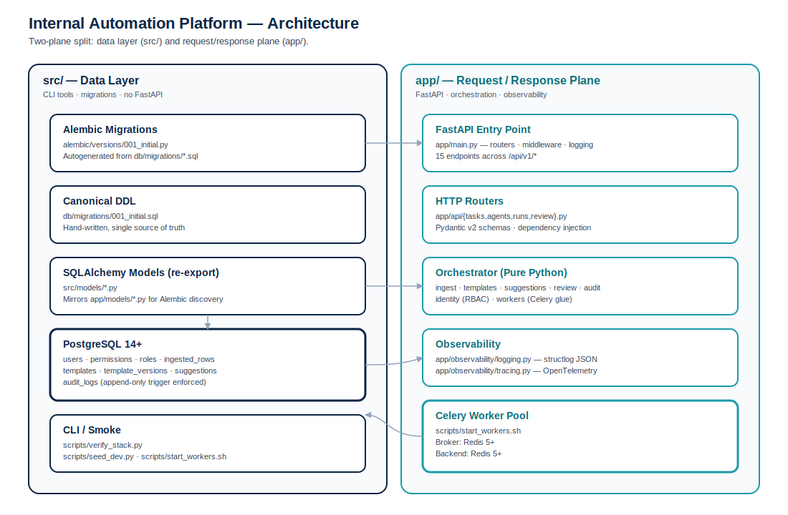
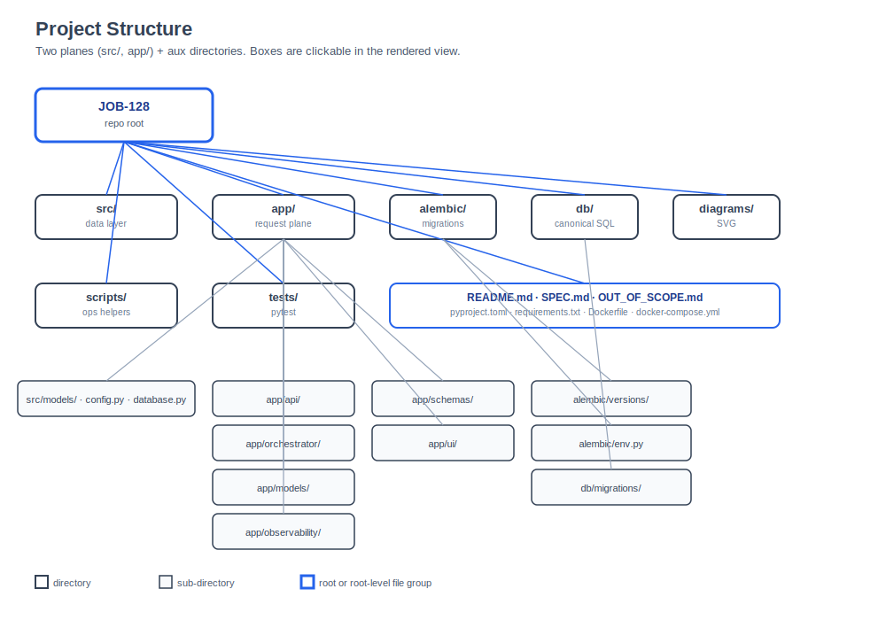
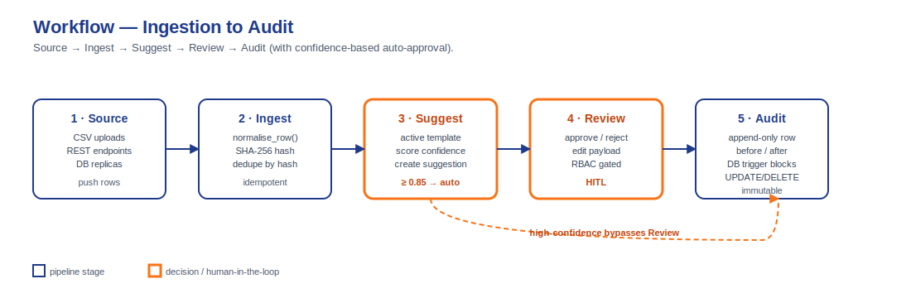

# Internal Automation Platform

> **Status:** v0.1.0 — initial scaffold.  See [OUT_OF_SCOPE.md](OUT_OF_SCOPE.md)
> for the list of features intentionally deferred from this build.

An internal data-ingestion + review + audit platform.  The system
ingests rows from external sources, normalises them, proposes
mappings to a target template, and routes low-confidence proposals
to a human review queue.  Every state change is recorded in an
append-only audit log.



## Business problem solved

Operations teams spend hours each week manually reconciling rows
from spreadsheets, database replicas, and ad-hoc CSV uploads.  The
Internal Automation Platform replaces that workflow with:

1. **Idempotent ingestion** — duplicate rows (same `source_id` +
   `source_row_hash`) are silently skipped, so re-running an
   import is safe.
2. **Auto-approval of high-confidence mappings** — when the
   orchestrator is confident (≥ 0.85), suggestions bypass the
   review queue entirely.
3. **Human-in-the-loop for the long tail** — low-confidence
   suggestions land in a review queue where a human can approve,
   reject, or edit before the mapping is applied.
4. **Immutable audit trail** — every state change is recorded as
   one append-only row.  The DB rejects UPDATE/DELETE on the
   audit log.

## Acceptance criteria

| ID  | Requirement |
|-----|-------------|
| REQ-001 | A POST to `/api/v1/tasks` creates a task and returns a 201 with the task ID. |
| REQ-002 | A GET on `/health` returns `{"status":"healthy","plane":"app"}` with HTTP 200. |
| REQ-003 | All `/api/v1/*` endpoints require an authenticated user; unauth requests get HTTP 401. |
| REQ-004 | Ingesting the same row twice (same `source_id` + `source_row_hash`) results in exactly one `ingested_rows` row. |
| REQ-005 | A suggestion with `confidence ≥ 0.85` is created with `state='approved'` and never appears in the review queue. |
| REQ-006 | A suggestion with `confidence < 0.85` is created with `state='pending_review'`. |
| REQ-007 | A POST to `/api/v1/review/{suggestion_id}/decide` with `decision='approve'` sets the suggestion's state to `approved` and writes one audit_log entry. |
| REQ-008 | The audit log rejects UPDATE and DELETE at the database level. |
| REQ-009 | The orchestrator modules are pure-Python (no HTTP) and callable from Celery workers. |
| REQ-010 | All config is read from environment variables; no secrets are committed to the repo. |

## What's in this repo

```
.
├── app/                  # Production FastAPI app (HTTP API + orchestration)
│   ├── api/              # FastAPI routers (tasks, agents, runs, review)
│   ├── models/           # Canonical SQLAlchemy ORM models
│   ├── orchestrator/     # Pure-Python ingest / templates / suggestions / audit
│   ├── observability/    # structlog + OpenTelemetry wiring
│   ├── schemas/          # Pydantic request/response models
│   ├── ui/               # Placeholder for the future UI bundle
│   ├── config.py         # Settings re-export
│   ├── database.py       # Engine / session re-export
│   ├── dependencies.py   # FastAPI dependency providers (auth, db session)
│   └── main.py           # FastAPI entry-point
├── src/                  # Data-layer plane (CLI tools, migrations)
│   ├── config.py         # Pydantic Settings (env-driven)
│   ├── database.py       # Async engine + session factory
│   ├── main.py           # CLI / migration smoke-test FastAPI app
│   └── models/           # Re-exports of the canonical app.models
├── alembic/              # DB migrations (autogenerated from db/migrations/*.sql)
├── db/migrations/        # Canonical hand-written DDL
├── diagrams/             # SVG architecture / workflow / structure diagrams
├── scripts/              # One-shot ops scripts (seed_dev, start_workers, verify_stack)
├── tests/                # pytest suite (unit + structural)
├── pyproject.toml        # Project metadata + tool config
├── requirements.txt      # Pinned dependencies
├── docker-compose.yml    # Local stack: postgres + redis + app + workers
├── Dockerfile            # Production image
├── .env.example          # Template env vars (no real secrets)
├── SPEC.md               # Product specification
├── OUT_OF_SCOPE.md       # Features intentionally excluded from this build
└── README.md             # You are here
```



## Quick start

```bash
# 1. Clone and enter the repo
git clone https://github.com/9KMan/JOB-20260702144531-000128.git
cd JOB-20260702144531-000128

# 2. Install dependencies (Python 3.11+)
python3 -m venv .venv
source .venv/bin/activate
pip install -r requirements.txt

# 3. Configure env (copy and edit)
cp .env.example .env

# 4. Bring up the local stack
docker compose up -d

# 5. Apply migrations
alembic upgrade head

# 6. Seed a dev user (optional, for local testing only)
python3 -m scripts.seed_dev

# 7. Start the API
uvicorn app.main:app --reload

# 8. Start the Celery workers (separate terminal)
./scripts/start_workers.sh 2

# 9. Run the test suite
pytest tests/ -v
```

## Architecture

The platform is split into two planes that share the same physical
database:

- **`src/`** is the *data layer* — Alembic env wiring, CLI smoke
  tests, async engine / session factory, and SQLAlchemy models
  (re-exports).  It does not import FastAPI.
- **`app/`** is the *request/response plane* — FastAPI routers,
  Pydantic schemas, structlog + OpenTelemetry, and the canonical
  orchestrator modules (pure Python, no HTTP).

The HTTP surface is small and intentional:

| Route | Purpose |
|-------|---------|
| `GET  /health` | Liveness probe (no auth) |
| `GET  /openapi.json` | OpenAPI 3.1 spec (no auth) |
| `POST /api/v1/tasks` | Enqueue a new task |
| `GET  /api/v1/tasks` | List tasks (filterable by state) |
| `GET  /api/v1/tasks/{id}` | Fetch one task |
| `DELETE /api/v1/tasks/{id}` | Cancel a task |
| `POST /api/v1/agents/heartbeat` | Record an agent heartbeat |
| `GET  /api/v1/agents` | List known agents |
| `GET  /api/v1/runs` | List run records (filterable) |
| `GET  /api/v1/runs/{id}` | Fetch one run |
| `GET  /api/v1/review/queue` | List suggestions awaiting review |
| `POST /api/v1/review/{id}/decide` | Approve / reject / edit a suggestion |

## Workflow

The end-to-end flow is: source → ingest → suggest → review → audit.

1. **Source** pushes rows (CSV, REST endpoint, DB replica).
2. **Ingest** normalises each row and computes a stable
   `source_row_hash`.  Duplicate rows (same source + hash) are
   silently skipped — this is the idempotency guarantee.
3. **Suggest** looks up the active template version, scores the
   mapping's confidence, and creates a `Suggestion` row.  If
   confidence ≥ 0.85, the suggestion's state is set to
   `approved` immediately.  Otherwise, it lands as
   `pending_review`.
4. **Review** (human-in-the-loop): a reviewer approves, rejects,
   or edits suggestions in the `pending_review` queue.  Each
   decision is recorded as an `audit_logs` row.
5. **Audit** is append-only — the database rejects UPDATE and
   DELETE on `audit_logs`.



## Tech stack

| Layer | Choice | Why |
|-------|--------|-----|
| Language | Python 3.11+ | Async, mature ecosystem |
| Web framework | FastAPI 0.109+ | OpenAPI-first, async-native, Pydantic integration |
| ORM | SQLAlchemy 2.0+ (async) | Typed Mapped[] columns, async session |
| Migrations | Alembic 1.13+ | Autogenerate from SQLAlchemy metadata |
| Validation | Pydantic 2.5+ | Single source of truth for request/response shapes |
| Queue | Celery 5.3+ | Battle-tested, Redis broker |
| Cache / broker | Redis 5+ | Standard, low-friction |
| Auth | python-jose + passlib | JWT + bcrypt for the local fallback path |
| Logging | structlog | Structured JSON logs |
| Tracing | OpenTelemetry | Vendor-neutral, future-proof |
| Database | PostgreSQL 14+ | JSONB + partial indexes + UUIDs out of the box |
| Tests | pytest | Standard, with parametrize for structural checks |

## Why these choices

- **FastAPI over Flask/Django:** we need OpenAPI-first APIs and
  async-native request handlers.  Django would force a heavier ORM
  and DRF; Flask would force us to assemble OpenAPI by hand.
- **Two-plane split (`app/` vs `src/`):** Alembic needs to be able
  to import models without pulling in FastAPI.  Splitting the
  package lets the migration tooling stay lean.
- **SQLAlchemy 2.0 typed `Mapped[]`:** the older declarative style
  (`Column = Column(...)`) is deprecated.  The new style gives
  type-checker support and removes the magic-string feel.
- **Celery over ARQ/RQ:** Celery's maturity and the broad Redis
  broker support outweigh the ARQ simplicity advantage for our
  workload (long-running orchestration tasks, not background
  webhooks).

## Documentation

- [SPEC.md](SPEC.md) — full product specification
- [OUT_OF_SCOPE.md](OUT_OF_SCOPE.md) — features intentionally deferred
- [diagrams/architecture.svg](diagrams/architecture.svg) — system
  architecture diagram
- [diagrams/workflow.svg](diagrams/workflow.svg) — end-to-end
  ingestion → review flow
- [diagrams/project-structure.svg](diagrams/project-structure.svg) —
  file/folder layout

## License

Proprietary — internal use only.

## Built by

Software Factory — JOB-20260702144531-000128.